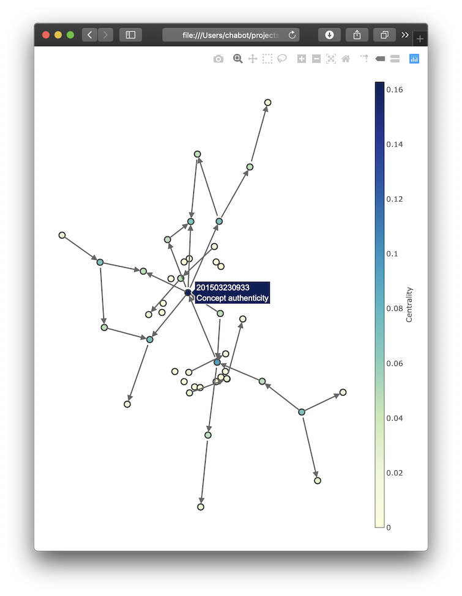

# zkviz: Visualize Link Network Between Zettels (Notes)


Produce an interactive overview of all your notes and their connections.



## Installing

I recommend using Python 3 and an environment specifically for zkviz.

Assuming that you're using macOS or Linux, to create the environment, open
a Terminal window and type the following to create the standalone environment
and activate it.

```sh
python3 -m venv ~/envs/zkviz
source ~/envs/zkviz/bin/activate
```

Then install zkviz with:

```sh
pip install zkviz
```

If [Graphviz](https://graphviz.org/download/) is installed on your computer,
zkviz can use it to draw the network. It is not a Python package so it needs to
be installed independently. If you're on a Mac and have
[Homebrew](https://brew.sh) installed, you can install Graphviz from a Terminal
with:

```sh
brew install graphviz
```

## Usage

To execute zkviz from the Terminal, you either need to add the zkviz
environment path to your `PATH` environment variable or specify the path to the
zkviz executable directly. Below, I use the explicit path.

Executing zkviz without any argument will build the visualization based on all
the `*.md` files found in the current directory.


```sh
~/envs/zkviz/bin/zkviz
```

You can also point zkviz to the folder containing your notes. For example:

```sh
~/envs/zkviz/bin/zkviz --notes-dir ~/Notes
```

By default zkviz will look for files with the `.md` extension, but you can override
the default with the `--pattern` option:

```sh
~/envs/zkviz/bin/zkviz --pattern '*.mkdown'
```

You can also specify multiple patterns separately. With the following, zkviz
will find all txt and md files. I recommend wrapping the pattern in quotes.

```sh
~/envs/zkviz/bin/zkviz --pattern '*.md' --pattern '*.txt'
```
You can also pass a list of files to zkviz:

```sh
~/envs/zkviz/bin/zkviz "~/Notes/201906021303 the state of affairs.md" "~/Notes/201901021232 Journey to the center of the earth.md"
```

To use Graphviz to generate the visualization, add the `--use-graphviz` option:

```sh
~/envs/zkviz/bin/zkviz --notes-dir ~/Notes --use-graphviz
```

## Using zkviz with Keyboard Maestro

The `keyboard-maestro` folder includes a [Keyboard Maestro](https://www.keyboardmaestro.com)
macro to automatically create a visualization based on the list of files
currently selected in [The Archive](https://zettelkasten.de/the-archive/). To
use this macro, download it and import it into Keyboard Maestro. The follow the
README comment within the macro to set the necessary variables.

## Making a Release

1. Bump the version in `zkviz/__init__.py`
2. Update the changelog, link the versions.
3. Commit and tag with version number
4. Build a source dist with `python setup.py clean && rm dist/* && python setup.py sdist`
5. Test upload to PyPI test with `twine upload --repository-url https://test.pypi.org/legacy/ dist/*`
6. Create a temporary environment `mktmpenv` and test install with `pip install --index-url https://test.pypi.org/simple/ zkviz`
7. If everything looks good, upload for real with `twine upload dist/*`

